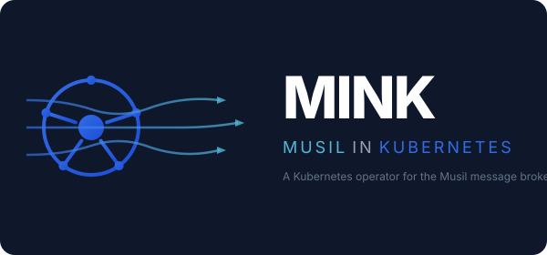

<p align="center">
  
</p>

# MINK

A Kubernetes operator for deploying and managing [Musil](https://github.com/jmpargana/musil) message brokers and topics.

## Overview

MINK automates the lifecycle of Musil brokers in Kubernetes. It provides two Custom Resource Definitions:

- **Broker** — deploys a Musil broker as a StatefulSet with a headless Service, persistent storage, and per-node configuration
- **Topic** — seeds topics into a running broker via a one-shot Job using the Musil seeder

## Quick Start

### Prerequisites

- Kubernetes cluster (v1.28+)
- `kubectl` configured
- CRDs installed (`make install`)

### Deploy a Broker

```yaml
apiVersion: mink.io.musil/v1
kind: Broker
metadata:
  name: my-broker
spec:
  storageSize: "1Gi"
  replicas: 1
  port: 9092
```

### Create a Topic

```yaml
apiVersion: mink.io.musil/v1
kind: Topic
metadata:
  name: events
spec:
  name: "events"
  numPartitions: 3
  replicationFactor: 1
  brokerRef: "my-broker"
```

## CRD Reference

### Broker Spec

| Field | Type | Default | Description |
|-------|------|---------|-------------|
| `image` | string | `ghcr.io/jmpargana/musil-server:0.1.5` | Broker container image |
| `replicas` | int32 | 1 | Number of broker replicas |
| `storageSize` | string | *required* | PVC size (e.g. `"1Gi"`) |
| `storageClassName` | string | cluster default | Storage class for PVCs |
| `port` | int32 | 9092 | Broker listen port |

### Topic Spec

| Field | Type | Default | Description |
|-------|------|---------|-------------|
| `name` | string | *required* | Topic name on the broker |
| `numPartitions` | uint32 | *required* | Number of partitions |
| `replicationFactor` | uint32 | 0 | Replication factor |
| `brokerRef` | string | *required* | Name of Broker CR in same namespace |
| `seederImage` | string | `ghcr.io/jmpargana/musil-seeder:0.1.5` | Seeder container image |

## Helm Installation

### Prerequisites

- Kubernetes 1.28+
- Helm 3.8+ (OCI support)

### Install

```bash
helm install mink oci://ghcr.io/jmpargana/charts/mink
```

### Install with a broker and topic

```bash
helm install mink oci://ghcr.io/jmpargana/charts/mink \
  --set broker.enabled=true \
  --set broker.spec.storageSize=1Gi \
  --set broker.spec.replicas=1 \
  --set broker.spec.port=9092 \
  --set topic.enabled=true \
  --set topic.spec.name=events \
  --set topic.spec.numPartitions=3 \
  --set topic.spec.replicationFactor=1 \
  --set topic.spec.brokerRef=mink-broker
```

### Uninstall

```bash
helm uninstall mink
```

For full values reference, see [charts/mink/README.md](charts/mink/README.md).

## End-to-End Example

Deploy a Musil broker, create a topic, then produce and consume messages.

### 1. Install the operator with a broker and topic

```bash
helm install mink oci://ghcr.io/jmpargana/charts/mink \
  --set broker.enabled=true \
  --set broker.spec.storageSize=1Gi \
  --set broker.spec.replicas=1 \
  --set broker.spec.port=9092 \
  --set topic.enabled=true \
  --set topic.spec.name=events \
  --set topic.spec.numPartitions=3 \
  --set topic.spec.replicationFactor=1 \
  --set topic.spec.brokerRef=mink-broker
```

### 2. Wait for the broker to become ready

```bash
kubectl wait --for=condition=Available broker/mink-broker --timeout=120s
```

### 3. Port-forward to the broker

```bash
kubectl port-forward svc/mink-broker 9092:9092 &
```

### 4. Produce messages

```bash
musil produce --broker localhost:9092 --topic events --message "hello world"
musil produce --broker localhost:9092 --topic events --message "second message"
```

### 5. Consume messages

```bash
musil consume --broker localhost:9092 --topic events --from-beginning
# Output:
# hello world
# second message
```

### 6. Cleanup

```bash
kill %1  # stop port-forward
helm uninstall mink
```

## Development

```bash
# Install CRDs
make install

# Run operator locally
make run

# Run tests (requires envtest binaries)
make test

# Build container image
make docker-build IMG=<registry>/mink:tag
```

## Architecture

```
Broker CR ──► BrokerReconciler ──► StatefulSet + Headless Service + ConfigMap
                                          │
                                    Pod Ready?
                                          │
                                    Status.URL set
                                          │
Topic CR  ──► TopicReconciler  ──► ConfigMap (seeder.toml) + Job (musil-seeder)
                                          │
                                    Job Complete?
                                          │
                                    Topic Ready ✓
```

## License

Apache License 2.0
